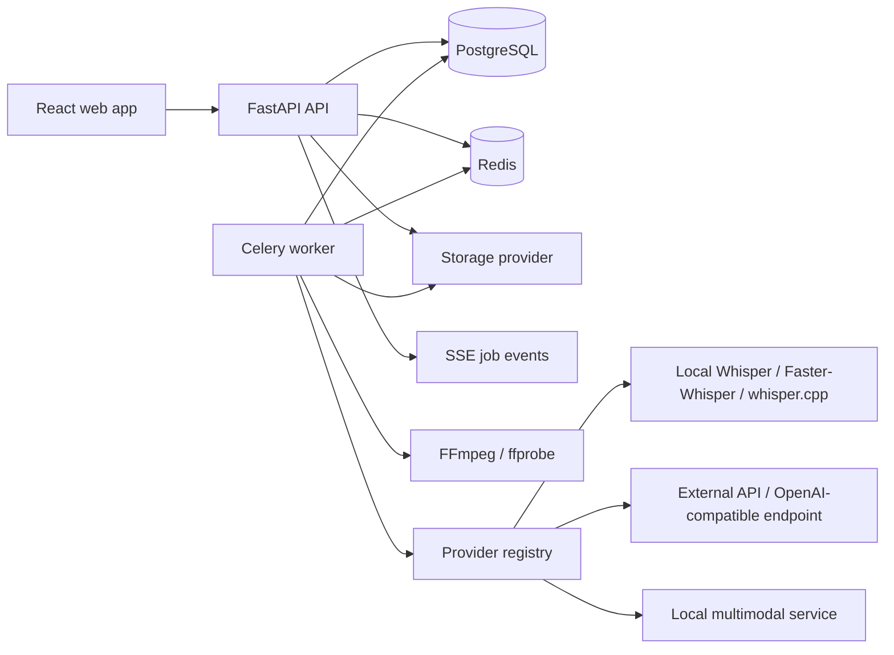

# Technical Architecture

## System context

The platform accepts sensitive media, creates durable media/transcript records, processes work asynchronously, and lets authorised users review and export results. The API process is intentionally stateless; it never executes long transcriptions in a request handler.



## Monorepo layout

```text
transcriber/
  backend/                 FastAPI app, services, adapters, Alembic, pytest
  frontend/                React application, component tests, Playwright
  worker/                  Celery app and task orchestration
  infra/                   Docker, Caddy, deployment examples, observability
  docs/                    Architecture and operator documentation
  scripts/                 Safe development and administrative utilities
```

The backend package owns domain models, API contracts, authorization, and provider abstractions. The worker imports the same domain and adapter packages but has a distinct process entry point and resource limits. Frontend state is API-derived; it never holds secret provider configuration.

## Domain services

| Service                 | Responsibility                                                                                                   |
| ----------------------- | ---------------------------------------------------------------------------------------------------------------- |
| `MediaService`          | Validate uploads, create assets, coordinate storage, and collect media metadata.                                 |
| `JobService`            | Validate job options, select an execution target, enqueue/cancel/retry work, and emit state changes.             |
| `TranscriptService`     | Store segments, speaker labels, edit operations, searches, and immutable transcript versions.                    |
| `ProviderService`       | Resolve enabled providers/models against capabilities, defaults, access policy, and hardware availability.       |
| `ModelService`          | Manage model catalog entries, background downloads, checksums, installed state, health tests, and task defaults. |
| `PostProcessingService` | Execute clean-up, translation, extraction, and report tasks through adapters.                                    |
| `ExportService`         | Render approved transcript/report data to requested formats in a background task.                                |
| `AuditService`          | Write structured, redacted security and lifecycle events.                                                        |

## Job orchestration

1. `POST /jobs` validates permissions, selection, sensitivity, and local/external policy.
2. The API persists a `transcription_job` in `queued` state and sends only its identifier to Celery.
3. A worker acquires a database row lock, creates an attempt, then advances through `extracting_audio`, `preprocessing`, `transcribing`, and `post_processing`.
4. Each stage is idempotent: intermediates are stored under an attempt-specific path and a retry may reuse a valid output.
5. The worker persists progress/events, segments, optional words/speakers, and timing/cost metadata.
6. The worker marks the job terminally `completed`, `failed`, or `cancelled`; an SSE endpoint streams persisted events to clients.

Cancellation is cooperative: the service records `cancel_requested_at`; workers check it between stages and model chunks. A process may be terminated only after its task is marked cancelled and cleanup rules are satisfied.

## Media and transcript lifecycle

- Original uploaded media is immutable and stored with a checksum.
- `ffprobe` records duration, codecs, container, and streams. Video inputs receive an extracted WAV/FLAC worker derivative when required by the selected provider.
- A transcription result becomes a `transcript` with ordered, timestamped `transcript_segments`; word rows are optional.
- Editing creates a new transcript version from a snapshot plus edit operations. The active version is the only version exported by default.
- AI post-processing, reports, and exports are derived artifacts linked to source transcript version IDs, so later edits never silently alter a prior report.
- Retention workers purge originals and derivatives according to organisation/project rules, preserving audit metadata required by policy.

## Hardware routing

At worker startup, a `HardwareProbe` detects CPU cores, system RAM, CUDA availability, GPU names, VRAM, and supported compute types. It writes a sanitized capability record. Provider selection validates a requested model against the target worker's hardware and queues GPU jobs separately from CPU jobs. Recommendations are advisory; administrators may override them if allowed by policy.

## Cross-cutting choices

- All external IO has explicit timeout, retry, circuit-breaker style backoff, and redacted structured logging.
- Provider configuration is data-driven but adapter implementation is code-reviewed and registered at startup.
- Pydantic schemas validate all public input; ORM models are never returned directly.
- API versioning begins at `/api/v1`; breaking changes require a new version.
- API responses contain opaque storage IDs and signed-download endpoints, never filesystem paths or decrypted credentials.
