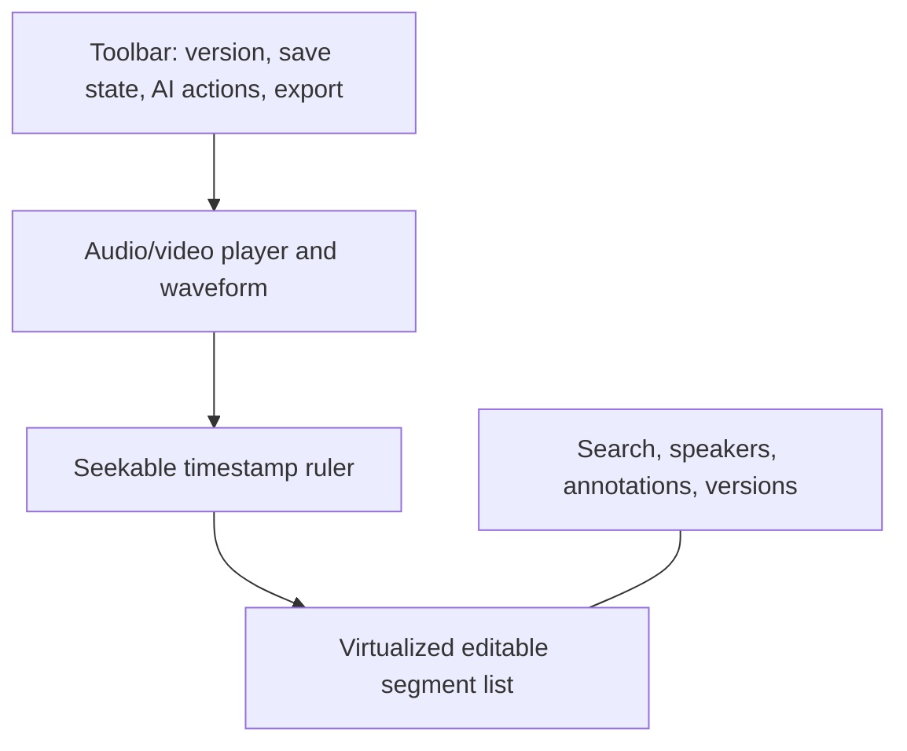

# Frontend Page Map

The frontend is a React single-page application with route-level permission guards, TanStack Query for API state, and server-sent event subscriptions for job updates. It uses responsive layouts but targets desktop-first editing because timeline/transcript work needs space.

| Route               | Page                   | Primary capabilities                                                      | Required permission       |
| ------------------- | ---------------------- | ------------------------------------------------------------------------- | ------------------------- |
| `/login`            | Login                  | Sign in, failed-login feedback, supported SSO placeholder                 | Public                    |
| `/`                 | Dashboard              | Job metrics, recent jobs, storage/cost summary, errors                    | `dashboard.read`          |
| `/upload`           | Upload media           | Drop zone, validation, file details, model/provider options, estimate     | `assets.create`           |
| `/jobs`             | Transcription jobs     | Status filters, event detail, retry/cancel, diagnostics                   | `jobs.read`               |
| `/jobs/:jobId`      | Job detail             | Stage timeline, selected target, output/error and attempts                | `jobs.read`               |
| `/transcripts`      | Transcript archive     | Search, filters, saved views, project-aware results                       | `transcripts.read`        |
| `/transcripts/:id`  | Transcript editor      | Player, waveform, editable segments, versions, speakers, AI tasks, export | `transcripts.read`        |
| `/reports`          | Reports                | Generated reports, status, export, source version visibility              | `reports.read`            |
| `/report-templates` | Template manager       | Built-in/custom schema sections, preview, enablement                      | `report_templates.manage` |
| `/models`           | Model manager          | Catalog, installed state, download/test progress, defaults                | `models.manage`           |
| `/providers`        | API provider manager   | Redacted configuration, capabilities, test, usage, defaults               | `providers.manage`        |
| `/users`            | User management        | Users, memberships, role assignments, deactivation                        | `users.manage`            |
| `/settings`         | Organisation settings  | Upload, storage, retention, local-only, queue policies                    | `settings.manage`         |
| `/storage`          | Storage management     | Usage, retention state, purge requests, provider health                   | `storage.manage`          |
| `/audit-logs`       | Audit logs             | Filter and export redacted audit records                                  | `audit.read`              |
| `/help`             | Help and documentation | Operator/user docs and troubleshooting                                    | Authenticated             |

## Upload experience

1. File chooser/drop zone validates extension, MIME signature, and configured size before transfer.
2. Upload row shows file name, size, browser transfer progress, detected duration when known, and validation feedback.
3. An execution selector provides `Automatic`, local installed models, and API providers. External choices display a clear data-egress warning plus policy block if applicable.
4. Advanced settings are generated from the selected target's capabilities. Unsupported options never appear as misleading controls.
5. Submitted files move to a persistent job drawer/list with live stage, progress, elapsed time, estimated remaining time, and cancellation.

## Transcript editor composition

- Clicking a timestamp seeks the media; `timeupdate` highlights and scrolls the active segment without stealing focus during edits.
- Segment edits are debounced into operation batches and saved with optimistic concurrency. A visible saved/conflict state protects users from silent loss.
- The editor supports keyboard actions for play/pause, next/previous segment, split, merge, speaker assignment, annotation, undo, and redo.
- Search results include contextual excerpts and seek targets. Selected segments can be exported or sent to a permitted AI task.
- AI results open as a reviewable draft/version rather than overwriting human text.

## Shared UX safeguards

- Confirmation dialogs identify irreversible deletion and external provider data transfer.
- Secret fields show only configured/not-configured state; they are never prefilled from an API response.
- Error banners provide a plain-language cause, safe remediation, request ID, and an administrator-only detail affordance.
- Loading UI distinguishes transferring, queued, processing, and finalization; it does not fake transcription progress.
